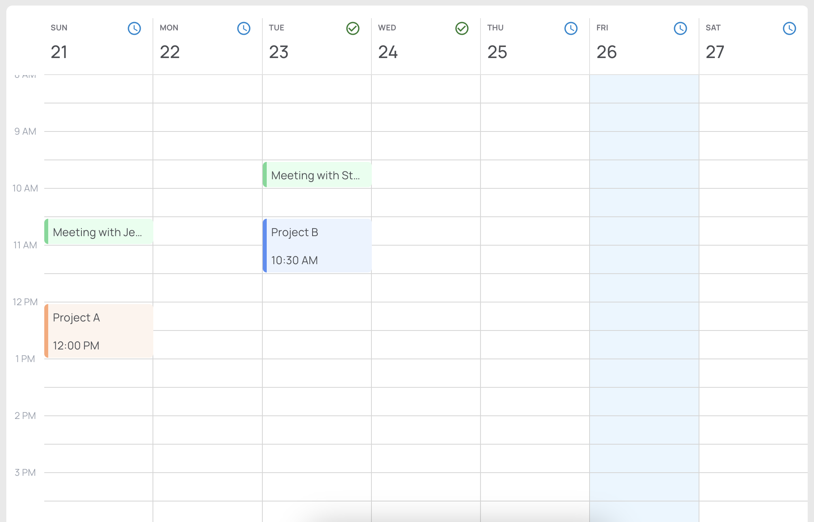
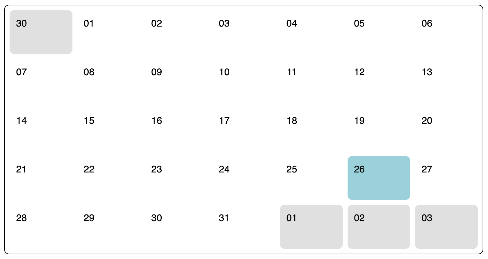

# calendaReact
A simple react+dayjs calendar component with 3 views:
### Small


### Week


### Month


## Example app
[View the example app here](https://richlaconte.github.io/calendareact/)

## Installation
```npm i calendareact```

## Usage
```jsx
import React, { useState } from 'react';
import Calendar from 'calendareact';

function App() {
  const [selectedDate, setSelectedDate] = useState<Dayjs>(dayjs())
  return (
    <Calendar
      events={[]}
      selectedDate={selectedDate}
      onSelectDate={(date: dayjs.Dayjs) => setSelectedDate(date)}
      colors={colors}
    />
  );
}

export default App;
```
